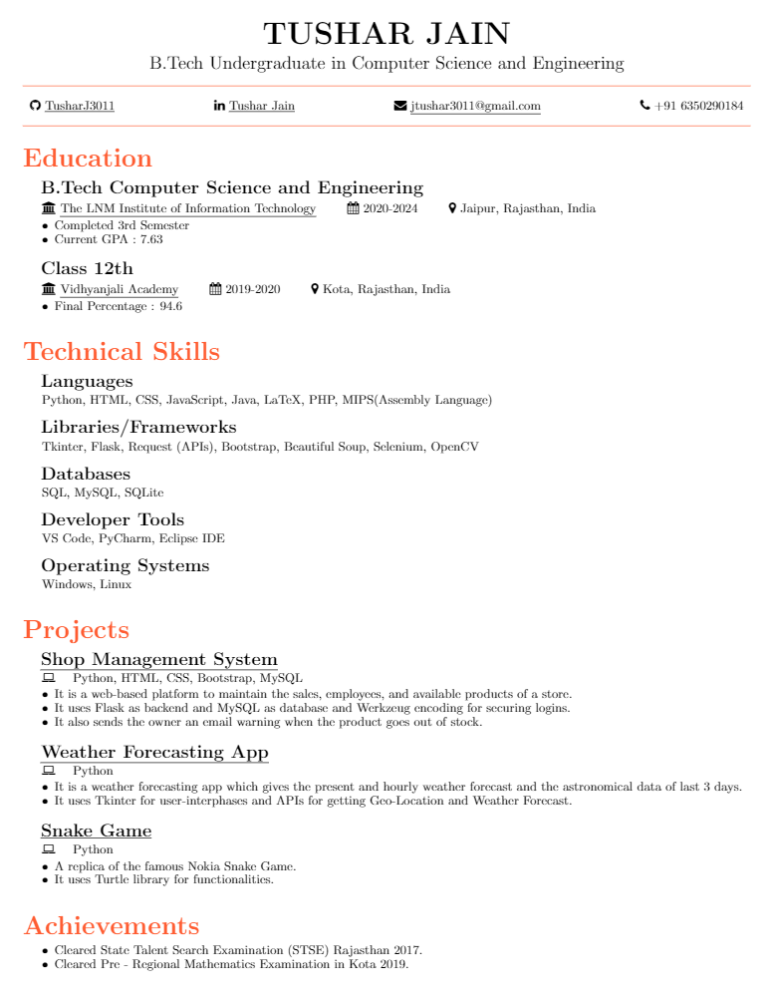

### Overview
A single-page, one-column resume for software developers. It's is build on LaTeX and base fonts to provide ease of use and installation when trying to update the resume. The three main sections in the resume are education, technical skills, and projects.

### Build using Overleaf Website
Go to [Overleaf](https://www.overleaf.com) website, choose a template and start customizing it or make your LaTeX resume from scratch and download it.

### Preview

